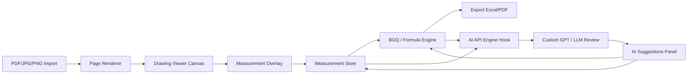
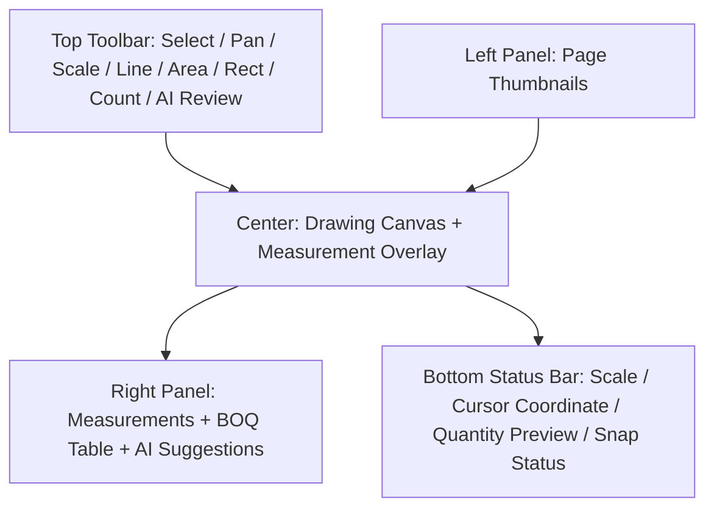

# Drawing Measurement Engine Specification v1.0

**โครงการ:** AI-Assisted Offline-First Construction Estimating Application  
**เอกสาร:** Drawing Measurement Engine Specification  
**ผู้จัดทำ:** Manus AI  
**วันที่:** 21 พฤษภาคม 2026  
**สถานะ:** Development Brief สำหรับส่งต่อ Claude Code, Cursor, Codex และทีมพัฒนา  

---

## 1. Executive Summary

เอกสารนี้เป็นสเปกเฉพาะของ **Drawing Measurement Engine** สำหรับโปรแกรมประมาณราคาก่อสร้างที่ต้องการทำงานคล้ายตัวอย่างใน TikTok ที่ผู้ใช้สามารถเปิดแบบก่อสร้างหลายหน้า คลิกจากจุดหนึ่งไปอีกจุดหนึ่งเพื่อวัดระยะ คลิกหลายจุดเพื่อวัดพื้นที่ ลากเมาส์คลุมพื้นที่หรือ object บนแบบ แล้วผูกผลลัพธ์เข้าสู่ BOQ ได้ทันที ระบบควรเริ่มจากแนวคิด **Manual-first, AI-assisted, auditable** กล่าวคือผู้ใช้เป็นผู้ควบคุมการวัดและยืนยันข้อมูล ส่วน AI ทำหน้าที่ช่วยตรวจ แนะนำ และลดงานซ้ำ โดยทุกปริมาณที่เกิดขึ้นต้องตรวจย้อนกลับไปยังตำแหน่งบนแบบได้

คำตอบต่อคำถามว่า “ควรทำเป็น web canvas ใช่ไหม” คือ **ใช่ แต่ควรเป็น Web Canvas-based interaction engine ที่มี vector overlay** มากกว่าการวาดทุกอย่างลง canvas เดียวทั้งหมด การออกแบบที่เหมาะคือให้แบบก่อสร้าง เช่น PDF/JPG/PNG ถูก render เป็น **background drawing layer** แล้วให้ measurement, node, polygon, marker, selection และ highlight อยู่บน **interactive overlay layer** ซึ่งอาจใช้ Canvas, SVG หรือ library อย่าง Konva/Fabric ตามความเหมาะสม HTML Canvas API ใช้สำหรับวาดกราฟิกแบบสคริปต์ได้โดยตรง [1] ขณะที่ Pointer Events ช่วยรวม mouse, pen และ touch input ให้อยู่ใน event model เดียว [2] และ PDF.js สามารถใช้ render หน้า PDF ใน browser/web runtime ได้ [3]

> **Product Principle:** โปรแกรมต้องให้ความรู้สึกเหมือนผู้ใช้กำลัง “ถอดแบบบนกระดาษดิจิทัล” แต่ทุกเส้น ทุกพื้นที่ และทุกจุดที่คลิกต้องกลายเป็นข้อมูลเชิงโครงสร้างที่ผูกกับ BOQ, สูตรคำนวณ, ประวัติการแก้ไข และ AI Review ได้

| หัวข้อ | ข้อสรุปสำหรับทีมพัฒนา |
|---|---|
| รูปแบบ UI หลัก | Web Canvas-based viewer พร้อม measurement overlay |
| เป้าหมาย MVP | PDF/JPG/PNG, zoom/pan, scale calibration, line/polyline/polygon/rectangle/count, BOQ link, export data, AI hook |
| สิ่งที่ไม่ควรเริ่มก่อน | DWG/DWF native editing, AI auto-takeoff 100%, full BIM, collaboration แบบ real-time |
| แนวทาง AI | AI เป็น service layer ผ่าน AI API Engine ไม่ผูกโดยตรงกับ canvas component |
| แนวทาง offline-first | งานเปิดแบบ วัด จัดหมวด ผูก BOQ และบันทึก project ต้องทำได้ในเครื่อง ส่วน AI ใช้เมื่อมี internet |

---

## 2. Product Goal และขอบเขตของ Engine

Drawing Measurement Engine คือแกนกลางของโปรแกรม ไม่ใช่แค่หน้าจอแสดงรูปแบบ แต่เป็นระบบที่เปลี่ยนการกระทำของผู้ใช้บนแบบให้กลายเป็นข้อมูลปริมาณที่คำนวณได้ ตรวจสอบได้ และนำไปใช้กับ BOQ ได้ ระบบนี้ต้องรองรับงานโครงสร้างและงานสถาปัตยกรรมในระยะแรก เช่น พื้น ผนัง ฝ้า ประตู หน้าต่าง เสา คาน พื้นคอนกรีต และรายการนับจำนวน

เป้าหมายเชิงประสบการณ์คือให้ผู้ใช้เปิดแบบแล้วทำงานได้ใกล้เคียงกับซอฟต์แวร์ถอดแบบมืออาชีพ ผู้ใช้ต้องสามารถซูมเข้าไปดูรายละเอียด คลิกจุดบนแบบ ลากครอบพื้นที่ เลือก object หรือ zone แล้วเห็นรายการปริมาณด้านขวาทันที เมื่อคลิก BOQ row โปรแกรมต้อง highlight กลับไปยัง measurement บนแบบได้

| Scope | Included in v1 | Notes |
|---|---:|---|
| เปิด PDF หลายหน้า | ใช่ | Render เป็น image/page canvas ก่อน |
| เปิด JPG/PNG | ใช่ | ใช้เป็น background layer โดยตรง |
| Thumbnail page navigator | ใช่ | ด้านซ้ายเหมือนตัวอย่าง TikTok |
| Zoom/Pan/Fit/Rotate | ใช่ | เป็น core UX |
| Scale calibration | ใช่ | คลิก 2 จุดที่รู้ระยะจริง |
| Node-to-node line measurement | ใช่ | สำหรับระยะ/ความยาว |
| Multi-node polygon area | ใช่ | สำหรับพื้นที่พื้น ฝ้า ผนัง zone |
| Rectangle selection | ใช่ | ลากครอบห้อง/object/zone |
| Lasso selection | ควรมีหลัง rectangle | ถ้าทำทันให้รวมใน v1.1 |
| Count marker | ใช่ | ประตู หน้าต่าง เสา สุขภัณฑ์ |
| BOQ mapping | ใช่ | Measurement ต้องผูกกับ BOQ item ได้ |
| AI Review Hook | ใช่ | ส่ง structured data ไป AI API Engine |
| DWG/DWF native | ไม่ใช่ v1 | ใช้แปลงเป็น PDF/image ก่อน |
| Auto object detection 100% | ไม่ใช่ v1 | ทำเป็น AI-assisted suggestion ภายหลัง |

---

## 3. Recommended Technical Architecture

สถาปัตยกรรมที่แนะนำคือแยกโปรแกรมเป็น 5 ชั้น ได้แก่ **Drawing Import Layer**, **Canvas Viewer Layer**, **Measurement Interaction Layer**, **BOQ/Formula Layer** และ **AI API Hook Layer** โดยแต่ละชั้นต้องสื่อสารผ่าน data model กลาง ไม่ควรให้ UI component ถือ logic ทั้งหมดไว้เอง เพราะภายหลังอาจต้องเปลี่ยนจาก web app เป็น desktop app ผ่าน Electron/Tauri หรือเปลี่ยนจาก local storage เป็น cloud database



| Layer | Responsibility | Suggested Implementation |
|---|---|---|
| Drawing Import Layer | รับไฟล์ PDF/JPG/PNG และแยกหน้า | PDF.js สำหรับ PDF, browser image decoder สำหรับ JPG/PNG |
| Page Renderer | แปลงหน้าแบบเป็น bitmap/page image ที่ canvas ใช้ได้ | render PDF page เป็น canvas/image cache |
| Viewer Layer | zoom, pan, rotate, page navigation, coordinate transform | React + Canvas/SVG/Konva stage |
| Measurement Overlay | node, line, polygon, marker, selection, hit testing | Konva.js/SVG overlay หรือ custom canvas overlay |
| Measurement Store | เก็บ geometry, quantity, category, status | Zustand/Redux/Context ใน frontend, SQLite/IndexedDB local persistence |
| BOQ/Formula Engine | ผูก measurement กับสูตรและรายการ BOQ | pure TypeScript service module |
| AI API Hook | เตรียม payload ส่ง AI API Engine | service adapter แยกจาก UI |

### 3.1 Canvas Strategy ที่แนะนำ

แม้จะเรียกโดยรวมว่า “web canvas” แต่ทางเทคนิคควรใช้แนวทาง **background raster + interactive vector overlay** เพราะแบบก่อสร้างมักมีรายละเอียดจำนวนมาก หากวาดทั้งแบบและ measurement ลงใน canvas เดียวจะจัดการ hit testing, selection, hover, edit node และ highlight ยากขึ้น การแยก layer จะทำให้ render เร็วขึ้น แก้ไข object ง่ายขึ้น และทำให้คลิก BOQ แล้ว highlight measurement ได้ชัดเจน

| Option | ข้อดี | ข้อเสีย | คำแนะนำ |
|---|---|---|---|
| Pure HTML Canvas | เร็ว คุม rendering ได้เต็มที่ | hit testing และ object editing ต้องเขียนเองมาก | เหมาะถ้าทีมเก่ง graphics engine |
| SVG Overlay | object/edit/DOM event ง่าย | ถ้า object มากอาจช้ากว่า | เหมาะกับ MVP ที่ object ไม่มหาศาล |
| Konva.js Canvas Scene Graph | จัดการ stage/layer/object/event ได้ดี | เพิ่ม dependency | แนะนำสำหรับ MVP เพราะลดภาระสร้าง engine เอง |
| Fabric.js | เหมาะกับ object editing | บาง pattern อาจหนักสำหรับ drawing viewer | ใช้ได้ แต่ต้องทดสอบ performance |

**Recommendation:** ให้เริ่มด้วย **React + TypeScript + Konva.js** หรือ equivalent scene-graph canvas library เพื่อทำให้ node editing, polygon editing, drag selection และ hit testing เร็วขึ้น ถ้าภายหลังมี performance issue ค่อย optimize เฉพาะส่วนเป็น custom canvas rendering

---

## 4. Target User Interface Layout

หน้าจอหลักควรใกล้เคียงกับตัวอย่าง TikTok ที่ผู้ใช้เห็นแบบอยู่กลางจอ thumbnail อยู่ซ้าย และตารางปริมาณ/BOQ อยู่ขวา ด้านบนเป็น toolbar สำหรับเลือกเครื่องมือวัด ด้านล่างเป็น status bar แสดง scale, coordinate, current tool และข้อความเตือน



| UI Zone | หน้าที่ | รายละเอียดสำคัญ |
|---|---|---|
| Top Toolbar | เลือก tool และ command | Select, Pan, Scale, Line, Polyline, Area, Rectangle, Count, Undo, Redo, AI Review |
| Left Thumbnail Panel | เลือกหน้าแบบ | PDF หลายหน้า, preview, page status, count measurement per page |
| Center Canvas | พื้นที่ทำงานหลัก | zoom, pan, draw, edit, select, highlight |
| Right Measurement/BOQ Panel | ตารางวัดและ BOQ | แสดง quantity, unit, category, formula, amount, link กลับไปแบบ |
| AI Suggestions Panel | แสดงผล AI | accept/reject suggestion, jump to target, explain reason |
| Bottom Status Bar | ข้อมูลสถานะ | current scale, cursor real coordinate, measurement preview, warning |

---

## 5. Coordinate System และ Scale Model

ทีมพัฒนาต้องให้ความสำคัญกับ coordinate system ตั้งแต่วันแรก เพราะข้อผิดพลาดเรื่อง scale และ coordinate จะทำให้ BOQ ผิดทั้งหมด ระบบควรแยก coordinate อย่างน้อย 4 ชุด ได้แก่ **screen coordinate**, **stage/canvas coordinate**, **page/image coordinate** และ **real-world coordinate**

| Coordinate Type | ตัวอย่าง | ใช้ทำอะไร |
|---|---|---|
| Screen Coordinate | mouse event clientX/clientY | รับ input จาก pointer event |
| Stage Coordinate | x/y หลังหัก pan/zoom | วาง object บน overlay |
| Page/Image Coordinate | x/y อิง pixel ต้นฉบับของหน้าแบบ | เก็บ geometry ถาวรใน database |
| Real-world Coordinate | meter/mm/sqm | คำนวณ BOQ และแสดงผลผู้ใช้ |

### 5.1 Rule สำคัญ

ให้เก็บ geometry ถาวรเป็น **page/image coordinate** ไม่ใช่ screen coordinate เพราะ screen coordinate เปลี่ยนตาม zoom, pan และ viewport ส่วน page/image coordinate คงที่ไม่ว่าผู้ใช้จะซูมอย่างไร

```ts
// Conceptual coordinate types
export type ScreenPoint = { clientX: number; clientY: number };
export type PagePoint = { x: number; y: number }; // pixel coordinate relative to original rendered page
export type RealPoint = { x: number; y: number; unit: 'm' | 'mm' };

export type ViewTransform = {
  zoom: number;
  panX: number;
  panY: number;
  rotationDeg: 0 | 90 | 180 | 270;
};
```

### 5.2 Scale Calibration

ผู้ใช้ต้องกำหนด scale ต่อหน้าแบบหรือ reuse จากหน้าอื่นได้ เครื่องมือ Scale Tool ทำงานโดยให้ผู้ใช้คลิกสองจุดบนระยะที่รู้ค่าจริง เช่น ระยะ grid 5.00 เมตร จากนั้นกรอกค่าระยะจริงและหน่วย โปรแกรมคำนวณ `unitPerPixel` หรือ `pixelPerUnit`

| Variable | ความหมาย |
|---|---|
| `p1`, `p2` | จุดสองจุดที่ผู้ใช้คลิกใน page coordinate |
| `pixelDistance` | ระยะ pixel ระหว่าง p1 และ p2 |
| `realDistance` | ระยะจริงที่ผู้ใช้กรอก เช่น 5.00 m |
| `unitPerPixel` | realDistance / pixelDistance |
| `pixelPerUnit` | pixelDistance / realDistance |

```ts
function distancePx(a: PagePoint, b: PagePoint): number {
  return Math.sqrt((b.x - a.x) ** 2 + (b.y - a.y) ** 2);
}

function calibrateScale(p1: PagePoint, p2: PagePoint, realDistance: number, unit: 'm' | 'mm') {
  const pixelDistance = distancePx(p1, p2);
  return {
    pixelDistance,
    realDistance,
    unit,
    unitPerPixel: realDistance / pixelDistance,
    pixelPerUnit: pixelDistance / realDistance,
  };
}
```

### 5.3 Formula พื้นฐาน

| Measurement Type | Geometry | Quantity Formula |
|---|---|---|
| Line | 2 points | `length = pixelLength * unitPerPixel` |
| Polyline | n points | `length = sum(segmentLengthPx) * unitPerPixel` |
| Polygon Area | closed polygon | `area = polygonAreaPx2 * unitPerPixel^2` |
| Rectangle Area | x, y, width, height | `area = widthPx * heightPx * unitPerPixel^2` |
| Count | point markers | `quantity = markerCount` |

Polygon area ให้ใช้ Shoelace Formula เพื่อให้คำนวณจากจุดหลายจุดได้ตรงไปตรงมา

```ts
function polygonAreaPx2(points: PagePoint[]): number {
  let sum = 0;
  for (let i = 0; i < points.length; i++) {
    const j = (i + 1) % points.length;
    sum += points[i].x * points[j].y - points[j].x * points[i].y;
  }
  return Math.abs(sum) / 2;
}
```

---

## 6. Tool State Machine

Measurement Engine ต้องมี state machine ชัดเจน ไม่ควรเขียน mouse event แบบกระจัดกระจายใน component เพราะเมื่อเพิ่ม tool จะควบคุมยาก ให้คิดว่าทุก tool มี lifecycle ได้แก่ `idle`, `drawing`, `editing`, `confirming`, `committed`, `cancelled`

| Tool | State เริ่มต้น | Pointer Down | Pointer Move | Pointer Up / Double Click | Commit Condition |
|---|---|---|---|---|---|
| Select | idle | เลือก object หรือเริ่ม drag box | preview selection | จบ selection | selected object set |
| Pan | idle | เริ่มจับ canvas | pan viewport | หยุด pan | update transform |
| Scale | idle | คลิก p1 แล้ว p2 | preview line | เปิด dialog ระยะจริง | user confirms real distance |
| Line | idle | คลิก p1 แล้ว p2 | preview segment | คลิก p2 จบ | 2 points |
| Polyline | idle | เพิ่ม node | preview segment | double click/Enter จบ | >= 2 points |
| Polygon Area | idle | เพิ่ม node | preview edge + area | double click/Enter ปิด polygon | >= 3 points |
| Rectangle | idle | start corner | resize preview | mouse up จบ | width/height > threshold |
| Lasso | idle | start free path | append path points | mouse up จบ | path closed or enough points |
| Count | idle | place marker | hover preview | click creates marker | marker saved |

### 6.1 Keyboard Shortcuts

| Shortcut | Action |
|---|---|
| `V` | Select Tool |
| `H` หรือ Space drag | Pan Tool ชั่วคราว |
| `S` | Scale Tool |
| `L` | Line/Polyline Tool |
| `A` | Area Polygon Tool |
| `R` | Rectangle Tool |
| `C` | Count Tool |
| `Esc` | Cancel current drawing |
| `Enter` | Commit current drawing |
| `Backspace` | ลบ node ล่าสุดระหว่าง drawing |
| `Ctrl/Cmd + Z` | Undo |
| `Ctrl/Cmd + Shift + Z` | Redo |

---

## 7. Pointer Event Specification

ควรใช้ Pointer Events เป็นหลัก ไม่ควรแยก mouse/touch/pen คนละระบบ เพราะ Pointer Events ถูกออกแบบให้รองรับ input หลายประเภทภายใต้ interface เดียว [2] โดยใน MVP ให้เน้น mouse ก่อน แต่โค้ดควรไม่ปิดทาง pen/touch ในอนาคต

| Event | หน้าที่ | ข้อมูลที่ต้องเก็บ |
|---|---|---|
| `pointerdown` | เริ่ม interaction | pointerId, button, screen point, page point, current tool, target object |
| `pointermove` | preview หรือ drag | current page point, delta, hover target, snap point |
| `pointerup` | จบ interaction | final point, committed geometry หรือ selection bounds |
| `pointercancel` | ยกเลิก interaction | clear draft state |
| `dblclick` หรือ custom double tap | commit polyline/polygon | close geometry |
| `wheel` | zoom in/out | mouse position as zoom anchor |

### 7.1 Pointer Data Object

```ts
export type PointerContext = {
  pointerId: number;
  button: number;
  shiftKey: boolean;
  altKey: boolean;
  ctrlKey: boolean;
  screen: ScreenPoint;
  page: PagePoint;
  timestamp: number;
  tool: MeasurementTool;
  hoveredObjectId?: string;
  snappedPoint?: PagePoint;
};
```

### 7.2 Drag Threshold

เพื่อป้องกันการคลิกพลาด ให้กำหนด drag threshold เช่น 3–5 pixels ใน screen coordinate ถ้าผู้ใช้ขยับต่ำกว่า threshold ให้ถือว่าเป็น click ถ้าเกิน threshold ให้ถือว่าเป็น drag selection หรือ pan ขึ้นกับ tool

| Interaction | Threshold ที่แนะนำ |
|---|---:|
| Click point | movement < 4 px |
| Drag rectangle | movement >= 4 px |
| Node hit radius | 6–10 px บน screen, ไม่ใช่ page coordinate |
| Segment hover tolerance | 4–8 px บน screen |

---

## 8. Measurement Geometry Model

Measurement ทุกชิ้นต้องเก็บเป็นข้อมูลกลางที่ไม่ผูกกับ UI library เพื่อให้ย้าย framework ได้และให้ AI API Engine อ่านได้โดยตรง ข้อมูลต้องเก็บทั้ง geometry, quantity, category, BOQ link, source page, status และ audit trail

```ts
export type MeasurementType =
  | 'scale_reference'
  | 'line'
  | 'polyline'
  | 'polygon_area'
  | 'rectangle_area'
  | 'lasso_area'
  | 'count_marker'
  | 'region_selection';

export type MeasurementStatus =
  | 'draft'
  | 'confirmed'
  | 'linked_to_boq'
  | 'ai_suggested'
  | 'locked'
  | 'archived';

export type MeasurementGeometry =
  | { kind: 'point'; point: PagePoint }
  | { kind: 'line'; points: [PagePoint, PagePoint] }
  | { kind: 'polyline'; points: PagePoint[] }
  | { kind: 'polygon'; points: PagePoint[] }
  | { kind: 'rectangle'; x: number; y: number; width: number; height: number }
  | { kind: 'lasso'; points: PagePoint[] };

export type Measurement = {
  id: string;
  projectId: string;
  drawingPageId: string;
  type: MeasurementType;
  geometry: MeasurementGeometry;
  label?: string;
  categoryId?: string;
  quantity: number;
  unit: 'm' | 'm2' | 'm3' | 'ea' | 'set';
  scaleId: string;
  status: MeasurementStatus;
  boqLinks: MeasurementBOQLink[];
  createdAt: string;
  updatedAt: string;
  createdBy?: string;
  metadata?: Record<string, unknown>;
};
```

### 8.1 Visual Style Mapping

| Measurement Status | สี/Style ที่แนะนำ | ความหมาย |
|---|---|---|
| Draft | เส้นประ สีเหลือง | กำลังวาด ยังไม่บันทึก |
| Confirmed | เส้นทึบ สีฟ้า | วัดแล้ว แต่ยังไม่ผูก BOQ |
| Linked to BOQ | เส้นทึบ สีเขียว | ผูก BOQ แล้ว |
| AI Suggested | เส้น/พื้นที่ สีม่วง | AI แนะนำ รอผู้ใช้ยืนยัน |
| Warning | สีส้ม/แดง | AI หรือ rule พบความผิดปกติ |
| Locked | สีเทาเข้ม | ยืนยันแล้ว ไม่แก้โดยไม่ unlock |

---

## 9. Core Measurement Workflows

### 9.1 Import และ Prepare Drawing

ผู้ใช้เริ่มจากสร้าง project แล้ว import PDF/JPG/PNG ระบบต้องสร้าง `DrawingFile` และ `DrawingPage` สำหรับแต่ละหน้า ถ้าเป็น PDF ให้ render หน้าเป็น bitmap สำหรับแสดงผล พร้อมเก็บ metadata เช่น page number, original width/height, render scale และ thumbnail

| Step | User Action | System Response |
|---|---|---|
| 1 | Import file | สร้าง project file record |
| 2 | เลือก PDF/JPG/PNG | ถ้า PDF แยกหน้า ถ้า image สร้าง page เดียว |
| 3 | Render thumbnails | แสดงหน้าแบบด้านซ้าย |
| 4 | ผู้ใช้เลือกหน้า | โหลด background drawing layer |
| 5 | ระบบตรวจ scale | ถ้ายังไม่มี scale ให้แนะนำใช้ Scale Tool |

### 9.2 Scale Tool Workflow

Scale Tool เป็น workflow แรกที่ต้องทำให้ดี เพราะทุก quantity จะอ้างอิง scale นี้

| Step | User Action | System Response |
|---|---|---|
| 1 | เลือก Scale Tool | cursor เปลี่ยนเป็น crosshair |
| 2 | คลิกจุดแรกบนแบบ | สร้าง draft scale line |
| 3 | คลิกจุดที่สอง | เปิด dialog ให้กรอกระยะจริง |
| 4 | กรอก 5.00 m | คำนวณ unitPerPixel |
| 5 | Confirm | บันทึก scale profile ให้ page |

Acceptance criteria ของ Scale Tool คือเมื่อผู้ใช้วัดเส้นเดิมอีกครั้ง ผลลัพธ์ต้องได้ระยะจริงใกล้เคียงค่าที่กรอก โดยความคลาดเคลื่อนเกิดจากตำแหน่งคลิกเท่านั้น ไม่ใช่สูตรคำนวณ

### 9.3 Node-to-Node Line Measurement

Line Tool ใช้สำหรับวัดระยะตรงหรือความยาวองค์ประกอบ เช่น คาน ผนัง รั้ว ขอบพื้น หรือแนวฝ้า ใน MVP ให้เริ่มจาก line 2 จุด แล้วค่อยขยายเป็น polyline หลาย segment

| Step | User Action | System Response |
|---|---|---|
| 1 | เลือก Line Tool | แสดง instruction “คลิกจุดเริ่มต้น” |
| 2 | คลิก p1 | วาง node แรก |
| 3 | เลื่อน mouse | preview line และแสดงความยาว real-time |
| 4 | คลิก p2 | บันทึก measurement |
| 5 | เลือก category | เช่น ผนังก่ออิฐ, คาน, บัวพื้น |
| 6 | Link BOQ | สร้างหรือผูก BOQ item |

### 9.4 Polygon Area Measurement

Area Tool ใช้สำหรับพื้นที่ เช่น พื้นกระเบื้อง ฝ้าเพดาน ผนังห้อง พื้นที่กันซึม และพื้นที่ zone ผู้ใช้คลิกหลาย node แล้วกด Enter หรือ double click เพื่อปิดรูป

| Step | User Action | System Response |
|---|---|---|
| 1 | เลือก Area Tool | cursor เป็น polygon mode |
| 2 | คลิก node ต่อเนื่อง | สร้าง polygon draft |
| 3 | เลื่อน mouse | preview edge ล่าสุดและพื้นที่ชั่วคราว |
| 4 | Double click หรือ Enter | ปิด polygon |
| 5 | ระบบคำนวณพื้นที่ | แสดง m² |
| 6 | ผู้ใช้ assign category | เช่น พื้นกระเบื้อง 60x60, ฝ้ายิปซัม |
| 7 | ระบบสร้าง BOQ link | measurement -> BOQ formula |

### 9.5 Rectangle/Lasso Selection

Rectangle Selection คือ feature ที่ทำให้ใกล้กับตัวอย่าง TikTok มากขึ้น เพราะผู้ใช้สามารถลากเมาส์คลุมพื้นที่หรือ object แล้วให้ระบบสร้าง region selection หรือส่ง crop ให้ AI วิเคราะห์ได้ ใน MVP ให้ทำ rectangle selection ก่อน ส่วน lasso selection ทำถัดไป

| Selection Type | วิธีใช้ | Output |
|---|---|---|
| Rectangle | drag จากมุมหนึ่งไปอีกมุม | rectangle geometry + crop bounds |
| Lasso | drag path อิสระ | lasso geometry + approximate polygon |
| Object Group Selection | drag ครอบ markers/measurements | selected measurement IDs |
| AI Region Selection | drag ครอบพื้นที่แล้วกด AI Analyze | crop image + bounds + context |

### 9.6 Count Marker

Count Tool ใช้สำหรับรายการนับ เช่น ประตู หน้าต่าง เสา สุขภัณฑ์ โคมไฟ หรืออุปกรณ์ โดยผู้ใช้คลิกวาง marker แล้ว assign type ระบบนับจำนวน marker ที่อยู่ใน category เดียวกัน

| Step | User Action | System Response |
|---|---|---|
| 1 | เลือก Count Tool | เลือก item type ก่อนหรือหลังคลิกได้ |
| 2 | คลิกตำแหน่ง object | วาง marker |
| 3 | กำหนด category | เช่น D1, W1, เสา C1 |
| 4 | ระบบรวมจำนวน | update quantity ใน measurement table |
| 5 | Link BOQ | สร้าง BOQ item หน่วย ea/set |

---

## 10. Selection, Hit Testing และ Editing

ผู้ใช้ต้องกลับมาแก้ measurement ได้ เช่น ย้าย node, ลบ node, เพิ่ม node, เปลี่ยน category หรือ unlink BOQ ระบบจึงต้องมี hit testing ที่ดี Hit testing ควรทำใน screen coordinate เพื่อให้ hit radius คงที่แม้ zoom เข้าออก

| Editable Object | Interaction |
|---|---|
| Node | drag เพื่อย้ายตำแหน่ง |
| Segment | hover เพื่อ highlight, คลิกขวาเพื่อ insert node |
| Polygon | select ทั้งพื้นที่, drag ทั้ง object ถ้า unlock |
| Marker | drag เพื่อย้าย, delete เพื่อลบ |
| Label | drag label position หรือ auto label |
| BOQ-linked object | แก้ได้แต่ต้อง update quantity และ audit trail |

### 10.1 Object Selection Rule

เมื่อผู้ใช้คลิกบน canvas ใน Select Tool ระบบควรเลือก object ตาม priority ดังนี้

| Priority | Target |
|---:|---|
| 1 | active node handle |
| 2 | marker/count point |
| 3 | line/polyline segment |
| 4 | polygon fill |
| 5 | region selection rectangle/lasso |
| 6 | background drawing |

ถ้าคลิก background ให้ clear selection ถ้ากด Shift ค้างไว้ให้ add/remove จาก selection set

---

## 11. BOQ Link Specification

Measurement Engine ต้องไม่หยุดที่การคำนวณปริมาณ แต่ต้องผูกข้อมูลเข้ากับ BOQ ทุก measurement ควรเลือก category และ mapping rule ได้ เช่น polygon พื้นที่ห้องหนึ่งอาจสร้าง BOQ หลายรายการ ได้แก่ ปูกระเบื้อง ปูนทรายปรับระดับ บัวพื้น หรือกันซึมในกรณีห้องน้ำ

```ts
export type BOQItem = {
  id: string;
  projectId: string;
  code: string;
  description: string;
  workCategory: 'structure' | 'architecture' | 'mep' | 'other';
  unit: 'm' | 'm2' | 'm3' | 'ea' | 'set';
  quantity: number;
  unitPrice?: number;
  amount?: number;
  source: 'manual' | 'measurement' | 'ai_suggested';
  links: MeasurementBOQLink[];
};

export type MeasurementBOQLink = {
  id: string;
  measurementId: string;
  boqItemId: string;
  formulaId: string;
  factor: number;
  wasteFactor?: number;
  quantityContribution: number;
  note?: string;
};
```

### 11.1 Formula Mapping Examples

| Measurement | BOQ Item | Formula |
|---|---|---|
| Polygon พื้นห้อง | งานปูกระเบื้องพื้น | `area * 1.00` |
| Polygon พื้นห้อง | ปูนทรายปรับระดับ | `area * thickness` หรือ `area` ตามหน่วย BOQ |
| Polygon ห้องน้ำ | งานกันซึมพื้น | `area * 1.00` |
| Line ความยาวผนัง | งานก่อผนัง | `length * wallHeight` |
| Line ความยาวผนัง | งานฉาบผนังสองด้าน | `length * wallHeight * 2` |
| Line ความยาวผนัง | งานทาสีผนัง | `length * wallHeight * sideFactor` |
| Count marker D1 | ประตู D1 | `count` |
| Count marker W1 | หน้าต่าง W1 | `count` |
| Rectangle/Polygon เสา | แบบหล่อ/คอนกรีต | phase ถัดไป ต้องมี height/depth input |

### 11.2 BOQ Row to Drawing Traceability

ทุก BOQ row ที่มาจาก measurement ต้องมีปุ่มหรือ interaction เพื่อย้อนกลับไปยังแบบได้ เมื่อผู้ใช้คลิก BOQ row ระบบต้องเปิดหน้าแบบที่เกี่ยวข้อง zoom ไปที่ geometry และ highlight measurement นั้น

| Action | Expected Result |
|---|---|
| Click BOQ row | เลือก BOQ item และ highlight linked measurements |
| Hover BOQ row | preview highlight สีอ่อนบน canvas |
| Click measurement | highlight BOQ row ที่เกี่ยวข้อง |
| Delete measurement | แจ้งเตือนว่าจะกระทบ BOQ item ใด |
| Edit geometry | update quantity และ BOQ contribution ทันที |

---

## 12. AI Hook Specification

AI ไม่ควรฝังอยู่ใน canvas component โดยตรง ให้สร้าง service ชื่อประมาณ `AIReviewService` หรือ `AIApiEngineClient` เพื่อรับข้อมูลจาก measurement store และ BOQ engine แล้วส่งไปยัง AI API Engine ภายนอก ระบบควรส่งเฉพาะข้อมูลที่จำเป็น เช่น geometry, quantity, category, BOQ row, page context และ crop image เฉพาะบริเวณที่ผู้ใช้เลือก

> **AI Principle:** AI ต้องให้ผลลัพธ์เป็น suggestion ที่ผู้ใช้ accept/reject ได้ ไม่ควรเขียนทับ BOQ หรือ geometry โดยอัตโนมัติใน MVP

### 12.1 AI Use Cases ใน v1

| AI Use Case | Trigger | Input | Output |
|---|---|---|---|
| AI BOQ Review | ผู้ใช้กด AI Review | BOQ rows + measurements summary | warning, missing items, abnormal quantities |
| AI Suggest Items from Area | หลังวัด polygon หรือ rectangle | selected region + category + crop image | related BOQ items |
| AI Explain Quantity | คลิก BOQ row แล้วถาม | BOQ item + linked measurements | explanation ว่าคำนวณอย่างไร |
| AI Region Analyze | ลากคลุมพื้นที่แล้วกด Analyze | crop image + page metadata | possible room/object/category |

### 12.2 AI Request Payload

```ts
export type AIReviewRequest = {
  requestId: string;
  project: {
    id: string;
    name: string;
    buildingType?: string;
  };
  drawingContext: {
    drawingPageId: string;
    pageNumber: number;
    scale: {
      unit: 'm' | 'mm';
      unitPerPixel: number;
    };
    selectedRegion?: {
      geometry: MeasurementGeometry;
      cropImageUrl?: string;
      cropImageBase64?: string;
    };
  };
  measurements: Measurement[];
  boqItems: BOQItem[];
  userQuestion?: string;
  mode: 'boq_review' | 'suggest_items' | 'explain_quantity' | 'region_analyze';
};
```

### 12.3 AI Response Schema

```ts
export type AISuggestion = {
  id: string;
  type:
    | 'missing_boq_item'
    | 'quantity_anomaly'
    | 'duplicate_item'
    | 'category_suggestion'
    | 'formula_suggestion'
    | 'explanation';
  severity: 'info' | 'warning' | 'critical';
  confidence: number; // 0-1
  title: string;
  message: string;
  targetMeasurementIds?: string[];
  targetBoqItemIds?: string[];
  proposedBoqItem?: Partial<BOQItem>;
  proposedFormula?: string;
  requiresUserConfirmation: true;
};
```

### 12.4 AI Suggestion UX

AI suggestion ต้องปรากฏใน panel ด้านขวา ผู้ใช้ต้องสามารถคลิก suggestion เพื่อ zoom ไปยังพื้นที่บนแบบได้ และต้องมีปุ่ม **Accept**, **Reject**, **Ask More**, **Create BOQ Item**, หรือ **Link to Existing BOQ**

| User Action | System Behavior |
|---|---|
| Accept missing BOQ item | สร้าง BOQ row ใหม่โดย source = `ai_suggested` |
| Reject suggestion | บันทึกสถานะ rejected เพื่อไม่เตือนซ้ำง่าย ๆ |
| Ask More | ส่ง follow-up ไป AI API Engine พร้อม context เดิม |
| Create BOQ Item | เปิด dialog ให้ผู้ใช้ตรวจ description/unit/formula ก่อนบันทึก |
| Link to Existing | ผูก suggestion เข้ากับ BOQ item ที่มีอยู่ |

---

## 13. Local Persistence และ Offline-First Behavior

แม้ระบบจะเชื่อม AI ผ่าน internet ได้ แต่ core measurement ต้องทำงาน offline ได้ การ import drawing, render page, zoom/pan, measurement, BOQ mapping และ export data ต้องไม่ขึ้นกับ AI service

| Function | Offline Required | Online Optional |
|---|---:|---:|
| เปิด project เดิม | ใช่ | ไม่จำเป็น |
| เปิด PDF/JPG/PNG ที่อยู่ในเครื่อง | ใช่ | ไม่จำเป็น |
| วัดระยะ/พื้นที่/จำนวน | ใช่ | ไม่จำเป็น |
| ผูก BOQ และสูตร | ใช่ | ไม่จำเป็น |
| Export Excel/JSON | ใช่ | ไม่จำเป็น |
| AI Review | ไม่ | ใช่ |
| Sync cloud project | ไม่ | ใช่ |

Local database อาจใช้ IndexedDB สำหรับ web app หรือ SQLite หากทำเป็น desktop app ผ่าน Tauri/Electron สิ่งสำคัญคือ data model ต้องเหมือนกัน เพื่อให้ย้าย storage backend ได้ภายหลัง

---

## 14. MVP Development Modules for Claude Code / Cursor / Codex

ให้ทีมพัฒนาแบ่งงานเป็น module เล็ก ๆ ห้ามเริ่มด้วยคำสั่งกว้างว่า “สร้างโปรแกรมถอดแบบทั้งหมด” เพราะจะเสี่ยงได้ architecture ที่หลวม ควร implement ตามลำดับต่อไปนี้

| Sprint | Module | Deliverable | Acceptance Criteria |
|---:|---|---|---|
| 1 | Project Shell + Layout | UI 3 panel: thumbnails, canvas, BOQ panel | เปิดหน้า app และ layout responsive ได้ |
| 2 | Image/PDF Page Viewer | import image/PDF, render page, show thumbnail | เปิด PDF หลายหน้าและ JPG/PNG ได้ |
| 3 | Zoom/Pan Engine | wheel zoom, drag pan, fit screen | zoom โดย anchor ที่ mouse และ pan ลื่น |
| 4 | Scale Tool | click 2 points + input real distance | คำนวณ scale และบันทึกต่อ page ได้ |
| 5 | Line Tool | node-to-node measurement | วัดความยาวจริงได้และแสดงใน table |
| 6 | Polygon Area Tool | multi-node area measurement | วัดพื้นที่ m² ได้ และ edit node เบื้องต้นได้ |
| 7 | Rectangle + Count Tool | drag rectangle, place markers | สร้าง region/count measurement ได้ |
| 8 | BOQ Mapping | link measurement to BOQ item/formula | คลิก BOQ แล้ว highlight บนแบบได้ |
| 9 | Local Persistence | save/load project | ปิดเปิด project แล้ว measurement ไม่หาย |
| 10 | AI Hook Stub | AI Review payload + mock response | กด AI Review แล้วเห็น suggestion mock |
| 11 | AI API Integration | connect API Engine | ส่ง payload จริงและแสดงผล accept/reject ได้ |

---

## 15. Prompt Pack สำหรับสั่ง Claude Code

ส่วนนี้เป็นข้อความที่สามารถนำไปใช้สั่ง Claude Code/Cursor/Codex ได้โดยตรง แนะนำให้เริ่มทีละ module และให้ AI coding tool อ่านเอกสารนี้ก่อนทุกครั้ง

### 15.1 Master Instruction

```text
You are building a Web Canvas-based Drawing Measurement Engine for a construction estimating application. Read the attached specification first. The application must be manual-first, AI-assisted, and auditable. Do not build full auto-takeoff AI in the first version. Focus on accurate canvas interaction, scale calibration, measurement geometry, BOQ linking, and clean data models.

Use React + TypeScript. Prefer a scene-graph canvas approach such as Konva.js unless there is a strong reason to implement custom canvas hit-testing. Store all persistent geometry in page/image coordinates, not screen coordinates. Implement services separately from UI components: coordinateTransformService, measurementService, formulaService, boqLinkService, and aiReviewClient.

Build incrementally. For every module, include TypeScript types, unit-testable pure functions for geometry calculations, and simple UI acceptance tests where practical.
```

### 15.2 Prompt: Build Canvas Layout

```text
Implement the main estimating workspace layout with three panels: left page thumbnails, center drawing canvas, and right measurement/BOQ panel. Add a top toolbar with Select, Pan, Scale, Line, Area, Rectangle, Count, and AI Review buttons. The center canvas should support a background drawing layer and a separate measurement overlay layer. Use placeholder image data first if PDF import is not ready.

Acceptance criteria:
1. The layout renders without overflow on desktop screen.
2. The active tool is visible in the toolbar.
3. The canvas area can receive pointer events.
4. The right panel can show an empty measurement table and BOQ table.
```

### 15.3 Prompt: Build Coordinate Transform and Zoom/Pan

```text
Implement coordinate transformation for screen-to-page and page-to-screen coordinates. Add zoom by mouse wheel anchored at cursor position and pan by dragging in Pan mode. Store geometry in page coordinates. Add tests for transform round-trip accuracy.

Acceptance criteria:
1. Zoom does not shift the point under the cursor unexpectedly.
2. Pan updates only viewport transform, not measurement geometry.
3. screenToPage(pageToScreen(p)) returns approximately p.
4. Existing measurement overlays remain aligned with the drawing after zoom/pan.
```

### 15.4 Prompt: Build Scale Tool

```text
Implement Scale Tool. The user clicks two points on the drawing, enters the real-world distance and unit, and the system creates a scale profile for the current drawing page. Show a preview line while selecting points and show calculated pixel distance and unitPerPixel after confirmation.

Acceptance criteria:
1. User can create a scale by clicking two points.
2. Scale is stored by drawingPageId.
3. Line measurement uses this scale to calculate real length.
4. If no scale exists, measurement tools show a warning.
```

### 15.5 Prompt: Build Line and Polygon Tools

```text
Implement Line Tool and Polygon Area Tool. Line Tool creates a two-point measurement. Polygon Area Tool allows multiple node clicks and commits on Enter or double click. Use pure geometry functions for length and polygon area. Add draft preview while drawing. Save measurement objects with id, pageId, type, geometry, quantity, unit, scaleId, and status.

Acceptance criteria:
1. Line quantity equals pixel length multiplied by unitPerPixel.
2. Polygon quantity equals shoelace area multiplied by unitPerPixel squared.
3. Draft geometry is visually different from confirmed geometry.
4. Confirmed measurements appear in the measurement table.
```

### 15.6 Prompt: Build Rectangle Selection and Count Marker

```text
Implement Rectangle Selection Tool and Count Marker Tool. Rectangle Tool creates a rectangle geometry by pointer drag and calculates area if scale exists. Count Tool places point markers and groups them by category. Add basic category assignment UI.

Acceptance criteria:
1. Dragging creates a rectangle with visible bounds.
2. Rectangle area updates after commit.
3. Clicking in Count Tool creates a marker.
4. Markers with the same category can be counted and linked to a BOQ item.
```

### 15.7 Prompt: Build BOQ Link and Traceability

```text
Implement BOQ linking. A measurement can be linked to one or more BOQ items through a formula link. Create data models for BOQItem and MeasurementBOQLink. When a BOQ row is clicked, highlight linked measurements on the canvas and zoom to their bounding box. When a measurement is edited, update quantityContribution and BOQ quantity.

Acceptance criteria:
1. Measurement can create or link to a BOQ item.
2. BOQ row displays quantity, unit, unit price, and amount.
3. Clicking BOQ row highlights source measurement.
4. Editing measurement updates BOQ quantity.
```

### 15.8 Prompt: Build AI Hook Stub

```text
Implement an AI Review client stub. When the user clicks AI Review, collect selected project, drawing page, measurements, and BOQ items into a structured AIReviewRequest payload. Do not call a real AI service yet. Return mock AISuggestion objects and show them in the AI Suggestions panel with Accept and Reject buttons.

Acceptance criteria:
1. AIReviewRequest payload matches the specification.
2. Mock suggestions render in the UI.
3. Accepting a missing BOQ item creates a draft BOQ row with source ai_suggested.
4. Rejecting a suggestion stores the rejected status.
```

---

## 16. Testing Strategy

Geometry และ formula ต้องมี unit test แยกจาก UI เพราะเป็นส่วนที่มีผลต่อ BOQ โดยตรง ส่วน canvas interaction ต้องมี integration test หรือ manual QA checklist ที่ชัดเจน

| Test Type | Target | Example |
|---|---|---|
| Unit Test | geometry functions | distance, polyline length, polygon area |
| Unit Test | scale functions | unitPerPixel, pixelPerUnit |
| Unit Test | formula engine | wall area, floor area, count |
| Integration Test | canvas transform | zoom/pan แล้วยังคลิกตำแหน่งถูก |
| Integration Test | BOQ linking | edit measurement แล้ว BOQ update |
| Manual QA | UX feel | คลิก ลาก ซูม วัด ต่อเนื่องเหมือนใช้งานจริง |

### 16.1 Critical QA Checklist

| Checklist | Expected Result |
|---|---|
| เปิด PDF 10 หน้าได้ | thumbnail แสดงครบและเลือกหน้าได้ |
| ซูมเข้าออกขณะมี measurement | measurement ยัง align กับแบบ |
| วัดเส้นบนระยะ scale เดิม | ค่าที่ได้ใกล้เคียงระยะจริง |
| วัด polygon แล้วแก้ node | พื้นที่และ BOQ update |
| คลิก BOQ row | canvas jump/highlight measurement |
| ลบ measurement ที่ผูก BOQ | ระบบเตือนผลกระทบก่อนลบ |
| ไม่มี internet | ยังเปิด project และวัดแบบได้ |
| AI service fail | core measurement ไม่พัง แสดง error ใน AI panel เท่านั้น |

---

## 17. Definition of Done สำหรับ Engine v1

Engine v1 จะถือว่าเสร็จเมื่อผู้ใช้สามารถทำงานครบวงจรดังนี้: import PDF/JPG/PNG, เลือกหน้าแบบ, set scale, วัด line/polygon/rectangle/count, assign category, link BOQ, click BOQ เพื่อ highlight กลับไปยังแบบ, save/load project และกด AI Review เพื่อส่ง payload/mock หรือ service จริงได้ โดยระบบต้องยังทำงานได้แม้ไม่มี internet ยกเว้นฟีเจอร์ AI

| DoD Item | Required |
|---|---:|
| TypeScript data model ครบ | ใช่ |
| Coordinate transform ถูกต้อง | ใช่ |
| Scale calibration ต่อหน้า | ใช่ |
| Measurement tools อย่างน้อย 4 แบบ | ใช่ |
| BOQ linking + traceability | ใช่ |
| Local save/load | ใช่ |
| AI hook payload | ใช่ |
| Unit tests สำหรับ geometry | ใช่ |
| Manual QA checklist ผ่าน | ใช่ |

---

## 18. Key Design Decisions

| Decision | Recommendation | เหตุผล |
|---|---|---|
| App type | Web Canvas-based, offline-first | พัฒนาเร็ว ย้ายไป desktop wrapper ได้ |
| Rendering | Background raster + vector/scene overlay | แยกแบบกับ measurement ชัดเจน |
| Geometry storage | Page/image coordinates | ไม่พังเมื่อ zoom/pan |
| AI integration | ผ่าน AI API Engine | ไม่ผูก UI กับ AI vendor |
| Measurement model | Structured object | ตรวจย้อนกลับและคำนวณ BOQ ได้ |
| MVP AI | Suggestion only | ลดความเสี่ยง AI แก้ข้อมูลผิด |
| DWG/DWF | Phase 2+ | ลด complexity และ license risk ในช่วงแรก |

---

## 19. References

[1]: https://developer.mozilla.org/en-US/docs/Web/API/Canvas_API "MDN Web Docs: Canvas API"  
[2]: https://developer.mozilla.org/en-US/docs/Web/API/Pointer_events "MDN Web Docs: Pointer events"  
[3]: https://mozilla.github.io/pdf.js/ "PDF.js"  
[4]: https://konvajs.org/docs/ "Konva.js Documentation"  
[5]: https://developer.mozilla.org/en-US/docs/Web/API/IndexedDB_API "MDN Web Docs: IndexedDB API"  

---

## 20. Short Handoff Note for Developer

ให้เริ่มจากการสร้าง **canvas interaction engine** ก่อน AI เสมอ เพราะถ้า measurement engine ไม่แม่น BOQ และ AI Review จะไม่มีฐานข้อมูลที่น่าเชื่อถือ งานที่ต้องทำให้ใกล้เคียง TikTok คือความลื่นของการเปิดแบบ คลิก node, ลากเลือกพื้นที่, เห็นปริมาณทันที และคลิก BOQ แล้วย้อนกลับไปยังตำแหน่งบนแบบได้ ส่วน AI ให้ต่อเป็น layer ที่รับ structured data แล้วส่ง suggestion กลับมาโดยไม่ทำลาย workflow หลัก

**ลำดับการพัฒนาที่แนะนำ:** Layout → Viewer → Zoom/Pan → Scale → Line → Polygon → Rectangle/Count → BOQ Link → Persistence → AI Hook

ถ้าทีมพัฒนาทำตามเอกสารนี้ จะได้ฐานระบบที่พร้อมต่อยอดเป็น AI-assisted estimating application แบบ offline-first และสามารถขยายไปสู่ online collaboration, Custom GPT integration, DWG/DWF support และ AI object detection ใน phase ถัดไปได้
